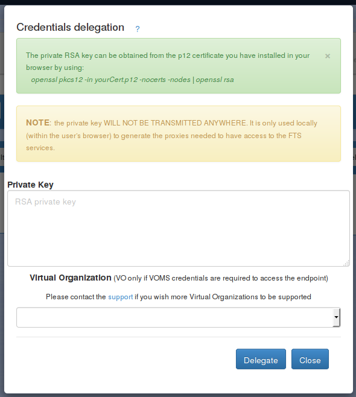
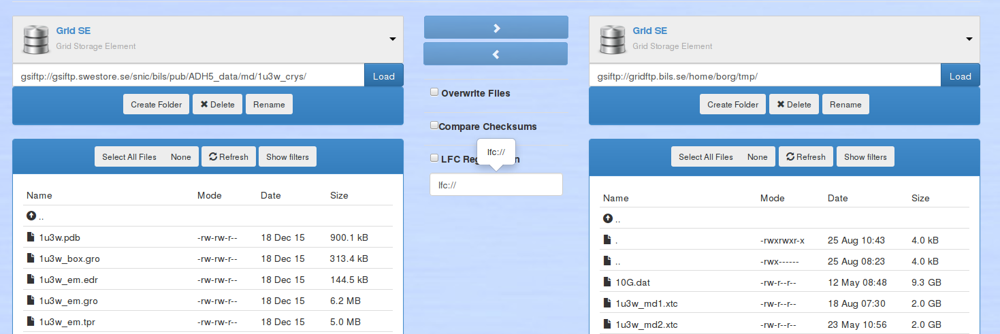
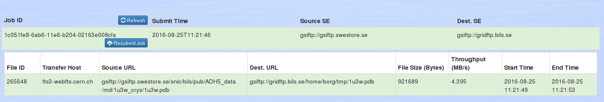
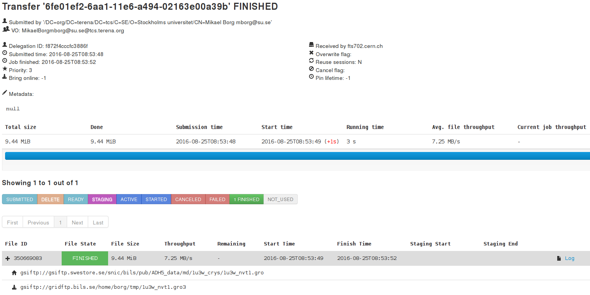

==========================
Test of FTS3 for transfers
==========================

*Mikael Borg*

August 2016

Background
==========

`FTS3 <http://fts3-service.web.cern.ch/>`__ is the service responsible
for globally distributing the majority of the Large Hadron Collider
(LHC) data across the Worldwide LHC Computing Grid (WLCG)
infrastructure. It is a low level, multi-protocol data movement service,
responsible for reliable bulk transfer of files from one site to another
while allowing participating sites to control the network resource
usage. A full description is available in the paper `FTS3: New Data
Movement Service For WLCG -
IOPscience <http://iopscience.iop.org/article/10.1088/1742-6596/513/3/032081/pdf>`__
and in the
`documentation <http://fts3-docs.web.cern.ch/fts3-docs/>`__.

In addition to effectuating data transfer jobs, the service can also be
used to monitor and log transfer jobs. Users can interact with FTS3
using command line tools, RESTful API calls or a web gui.

Excelerate task 4.3.3 had a meeting with the FTS3 developers in June
2016 to learn more about the service. We decided to do some testing on
the FTS3 instance deployed by CERN,
https://fts3-pilot.cern.ch:8446.

Testing FTS3
============

Install command-line client
---------------------------

The package fts-tools is available in the `EPEL
repository <https://fedoraproject.org/wiki/EPEL>`__ that is compatible
with Red Hat Enterprise Edition/Centos/Scientific Linux. Once the
repository is enabled, the software can be installed by::

  yum install fts-tools

The command-line tools have well-written man-pages, and there is also
documentation available online:
`http://fts3-docs.web.cern.ch/fts3-docs/docs/cli/cli.html <http://fts3-docs.web.cern.ch/fts3-docs/docs/cli/cli.html>`__

Create and delegate proxy certificate
-------------------------------------

The transfer service require a proxy certificate::

  grid-proxy-init

Delegate proxy to fts service::

  fts-delegation-init -s https://fts3-pilot.cern.ch:8446

In this test, a grid certificate is used to generate proxy certificates,
as ELIXIR proxy certificates are currently not accepted by the fts3
server::

  $ fts-delegation-init -v -s https://fts3-pilot.cern.ch:8446 --proxy
  /tmp/elixir-proxy

  Remaining time for the local proxy is: 228hours and 59 minutes.

  Communication problem: SSL connect error

Submit a transfer job
---------------------

::

  fts-transfer-submit -s https://fts3-pilot.cern.ch:8446
  gsiftp://gsiftp.swegrid.se/snic/bils/pub/ADH5\_data/md/1u3w\_crys/1u3w\_nvt1.gro
  gsiftp://gridftp.bils.se/home/borg/tmp/1u3w\_nvt1.gro

  1180d97a-6856-11e6-bfe8-02163e00a17a

Note that the source and destination URL's are ordinary gridftp
endpoints. The fts service has support for several protocols. The
following job transfers a file via http from the Short Read Archive at
EBI to a gridftp endpoint::

  $ fts-transfer-submit -s https://fts3-pilot.cern.ch:8446
  http://ftp.sra.ebi.ac.uk/vol1/fastq/SRR741/SRR741952/SRR741952.fastq.gz
  gsiftp://gridftp.bils.se/home/borg/tmp/SRR741952.fastq.gz

It is also possible to do bulk transfers by specifying all
source-destination pairs in an input file.

Query transfer job
------------------

::

  $ fts-transfer-status --verbose -d -s https://fts3-pilot.cern.ch:8446 -l
  1180d97a-6856-11e6-bfe8-02163e00a17a
  # Using endpoint : https://fts3-pilot.cern.ch:8446
  # Service version : 3.5.1
  # Interface version : 3.5.1
  # Schema version : 1.2.0
  # Service features : fts3-rest-3.5.1
  # Client version : 3.4.7
  # Client interface version : 3.4.7
  Request ID: 1180d97a-6856-11e6-bfe8-02163e00a17a
  Status: ACTIVE
  Client DN: /DC=org/DC=terena/DC=tcs/C=SE/O=Stockholms
  universitet/CN=Mikael Borg mborg@su.se
  Reason: null
  Submission time: 2016-08-22 12:49:15
  Files: 1
  Priority: 3
  VOName: MikaelBorgmborg@su.se@tcs.terena.org
    Active: 1
    Ready: 0
    Canceled: 0
    Finished: 0
    Submitted: 0
    Failed: 0
    Staging: 0
    Started: 0
    Delete: 0

  Source:
  gsiftp://gsiftp.swegrid.se/snic/bils/pub/ADH5\_data/md/1u3w\_crys/1u3w\_nvt1.gro
  Destination: gsiftp://gridftp.bils.se/home/borg/tmp/1u3w\_nvt1.gro
  State: ACTIVE
  Reason:
  Duration: -3680938157
  Staging: 0
  Retries: 0

Additional information using REST API
-------------------------------------

In addition to the command line tools, it is possible to communicate
with fts3 using its RESTful API. This can give additional information,
such as the transfer rate (in MB/s) and a link to the log file of the
transfer. In the following example, we query a finished job::

  $ curl -k -E /tmp/x509up\_u505 https://fts3-pilot.cern.ch:8446/jobs/6fe01ef2-6aa1-11e6-a494-02163e00a39b/files

  [
    {
      "symbolicname": null,
      "tx\_duration": 1.303,
      "pid": 30209,
      "hashed\_id": 50397,
      "num\_failures": null,
      "log\_debug": 0,
      "retry": 0,
      "job\_id": "6fe01ef2-6aa1-11e6-a494-02163e00a39b",
      "job\_finished": "2016-08-25T08:53:52",
      "wait\_timestamp": null,
      "staging\_start": null,
      "filesize": 9899611,
      "source\_se": "gsiftp:\\/\\/gsiftp.swestore.se",
      "file\_state": "FINISHED",
      "start\_time": "2016-08-25T08:53:49",
      "activity": "default",
      "file\_index": 0,
      "reason": "",
      "wait\_timeout": null,
      "file\_id": 350669083,
      "error\_phase": null,
      "source\_surl":
      "gsiftp:\\/\\/gsiftp.swestore.se\\/snic\\/bils\\/pub\\/ADH5\_data\\/md\\/1u3w\_crys\\/1u3w\_nvt1.gro",
      "bringonline\_token": null,
      "selection\_strategy": "auto",
      "retries": [

      ],
      "dest\_surl":
      "gsiftp:\\/\\/gridftp.bils.se\\/home\\/borg\\/tmp\\/1u3w\_nvt1.gro3",
      "internal\_file\_params": "nostreams:1,timeout:4000,buffersize:0",
      "finish\_time": "2016-08-25T08:53:52",
      "dest\_se": "gsiftp:\\/\\/gridftp.bils.se",
      "staging\_finished": null,
      "user\_filesize": 0,
      "file\_metadata": null,
      "error\_scope": null,
      "transferhost": "fts703.cern.ch",
      "throughput": 7.24559,
      "checksum": null,
      "log\_file":
      "\\/var\\/log\\/fts3\\/transfers\\/2016-08-25\\/gsiftp.swestore.se\_\_gridftp.bils.se\\/2016-08-25-0853\_\_gsiftp.swestore.se\_\_gridftp.bils.se\_\_350669083\_\_6fe01ef2-6aa1-11e6-a494-02163e00a39b",
      "agent\_dn": null,
      "reason\_class": null,
      "vo\_name": "MikaelBorgmborg@su.se@tcs.terena.org",
      "recoverable": false
    }
  ]

Web interfaces
--------------

webfts
~~~~~~

FTS3 provides several web interfaces for interacting with fts3. The
webfts interface can be used to submit transfer jobs, but requires the
user to paste his/her private key so that it is saved **locally** in the
browser, and then used to generate proxy certificates. It is then
possible to browse endpoints and initiate data transfers.

Link: https://webfts.cern.ch/

Browsing two endpoints:

Viewing past transfer jobs:

There is ongoing development to have the web interface authenticate via
SAML, and then obtain proxy certificates by making API calls to a
credential translation service. Currently, there is only support for the
CERN Security Token Service (STS). The code is in the ‘kipper’ branch of
webfts:
https://gitlab.cern.ch/fts/webfts/tree/kipper, which in turn requires the software ‘kipper’: https://gitlab.cern.ch/sts/kipper/tree/master.

Ftsmon
~~~~~~

Ftsmon is a separate web application where monitoring of jobs can be
achieved with the certificate installed in the browser, but without
entering the private key.

Link:
https://fts3-pilot.cern.ch:8449/fts3/ftsmon

Dashboard
~~~~~~~~~

The FTS Dashboard gives an overview of transfers across different VO's
and technologies.

Link:
http://dashb-fts-transfers.cern.ch/ui

Notes
=====

-  The FTS3 service seems to fulfill most of the requirements that we
   have for an ELIXIR data transfer service: multi-protocol,
   monitoring and logging, checksums, API, web gui, …

-  The software is free software (Apache License, Version 2.0) and seems
   straight-forward to deploy. All components are available in the
   RHEL/CENTOS EPEL repository. `Installation and configuration
   guide <http://fts3-docs.web.cern.ch/fts3-docs/docs/install.html>`__.

-  The fts3 development team is very approachable.

-  Some development is needed if we want to make the webfts interface
   connect to the ELIXIR credential translation service for proxy
   certificates.

-  It seems like logs of transfers jobs are per default public. This
   might be a problem in some cases (e.g. pharma companies that want
   to hide what they are working on).

